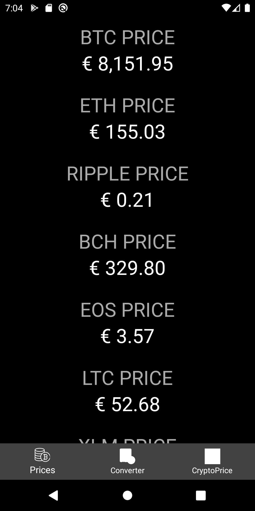

# CryptoApp
Here are the three main Fragment Activities.

## Prices
Here you can refresh and view prices of various cryptocurrencies.

  

## Converter

Choose the cryptocurrency you want to convert and switch to the corresponding side.

  

## Mining profitability

Calculate your Bitcoin mining profitability by inserting the data and choosing hashrate multiplier from the dropdown menu.

  

